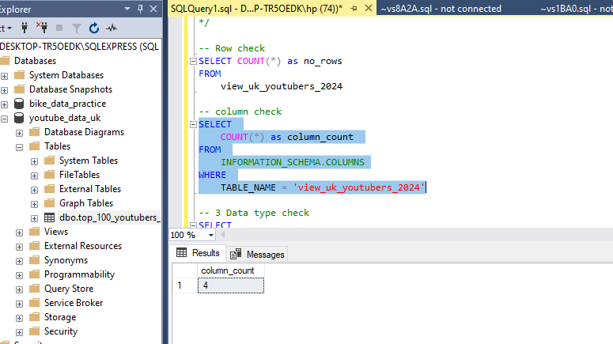
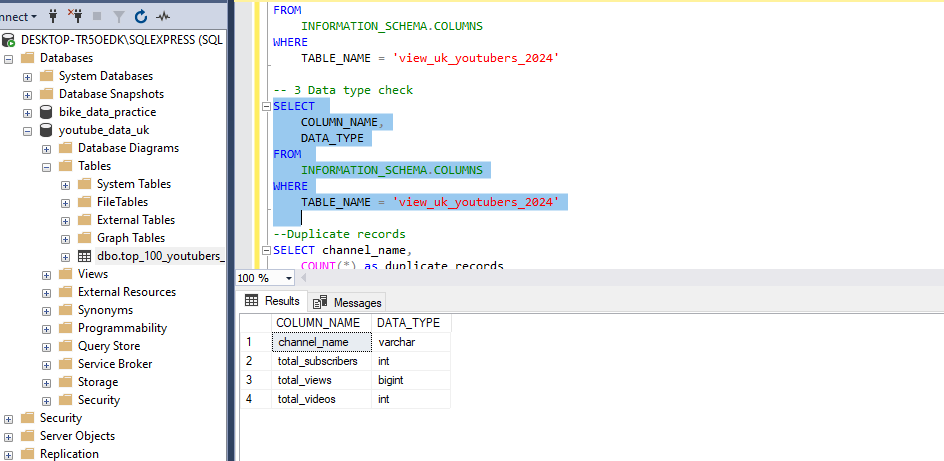

# Data Portfolio: SQL to Power BI to Excel


.gif)


<content> # Table of contents </content>
- [Objective](#objective)
- [Data Source](#data-source)
- [Stage](#stages)
- [Design](#design)
    - [Tools](#tools)
- Development(#development)
    - [Pseduocode](#pseduocode)
    - [Data Exploration](#data-exploration)
    - [Data Cleaning](#data-cleaning)
    - [Transform the Data](#Transform-the-Data)
    - [Create the SQL view](#Create-the-SQL-view)
- [Data Quality Test](#data-quality-test)
- [Visualization](#visualization)
  - [Results](#results)
  - [DAX Measures(#dax-measures)
- [Analysis](#analysis)
  - [Findings](#findings)
  - [Validation](#validation)
  - [Discovery](#discovery)
- [Recommendation](#recommendation)
  - [Potential ROI](#potential ROI)
  - [Potential Course of Actions](#Potential-courses-of-actions)
  - [Conclusion](#conclusion)
 

# Objective  
 <br>
- Key Point

 The Head of Marketing wants to find out who the top YouTubers are in 2024 to decide which ones to use for the rest of the year's marketing campaigns

 - Solution
Create a dashboard that provides insights into the top UK YouTubers in 2024 including their:
- total number of subscriber 
- total number of views
- total number of videos, and
- engagement metrics

This will help the marketing team make data-driven decisions about which YouTubers to collaborate with for their marketing campaigns.


## User story 

As the Head of Marketing, I need a dashboard that can help me analyze YouTube channel data within the UK. 

This dashboard should allow me to identify the top-performing channels based on KPIs like subscriber base and average views. 

With this information, I can make more informed decisions about which Youtubers are right to collaborate with, to maximize each marketing campaign.


# Data source 

we need data on the top UK YouTubers in 2024 including their: 
- channel names
- total subscribers
- total views
- total videos uploaded

- Data Source
Kaggle. [see here to find it.](https://www.kaggle.com/datasets/bhavyadhingra00020/top-100-social-media-influencers-2024-countrywise?resource=download)


# Stages

- Design
- Development
- Testing
- Analysis 
 

# Design 

## Dashboard features  

To understand what features it should contain, we need to figure out what questions we need the dashboard to answer:

1. Who are the top 10 YouTubers with the most subscribers**?
2. What are the top 3 channels with the most videos uploaded?
3. What are the top 3 channels with the most views?
4. What are the top 3 channels with the highest average views per video?
5. What are the top 3 channels with the highest views per subscriber ratio?
6. What are the top 3 channels with the highest subscriber engagement rate per video uploaded?

These are some of the questions we need to answer.


## Dashboard mockup

Some of the data visuals that may be appropriate for answering our questions include:

1. Table
2. Treemap
3. Scorecards
4. Horizontal bar chart 


## Tools 


| Tool | Purpose |
| ---- | ---- |
| Excel | Exploring the data |
| SQL Server | Cleaning, quality testing, and analyzing the data |
| Power BI | Visualizing the data via interactive dashboards |
| GitHub | Hosting the project documentation and version control |

# Development

## Pseudocode

- What's the general approach in creating this solution from start to finish?

1. Get the data
2. Explore the data in Excel
3. Load the data into SQL Server
4. Clean the data with SQL
5. Test the data with SQL
6. Visualize the data in Power BI
7. Generate the findings based on the insights
8. Write the documentation + commentary
9. Publish the data to GitHub Pages

## Data exploration notes

This is the stage where you have a scan of what's in the data including errors, inconsistencies, or corrupted characters, etc  


- Initial observations 

1. There are at least 4 columns that contain the data we need for this analysis.
2. The first column contains the channel ID with what appears to be channel IDS, which are separated by a @ symbol - we need to extract the channel names from this.
3. Some of the cells and header names are in a different language - we need to confirm if these columns are needed, and if so, we need to fix them.
4. We have more data than we need, so some of these columns would need to be removed


## Data cleaning 

The aim is to refine our dataset to ensure it is structured and ready for analysis. 

The cleaned data should meet the following criteria and constraints:

- Only relevant columns should be extracted.
- All data types should be appropriate for the contents of each column (e.g VARCHAR. INT)
- No column should contain null values, indicating complete data for all records.

Below is a table outlining the constraints on our cleaned dataset:
|Property| Description|
|--------| -----------|
|Nunber of Rows| 100|
|Number of columns | 4|

Here's the tabular representation of the expected schema of the clean data:
|Column name| Data type| Null values|
|-----------|----------|------------|
|channel_name|VARCHAR| - |
|tota_subscribers| INT |-|
|total_views| INT|-|
|total_videos| INT|-|

-Steps are needed to clean and shape the data:

1. Remove unnecessary columns by only selecting the ones needed
2. Extract YouTube channel names from the first column(characters before the "@")
3. Rename columns using aliases


### Transform the data 


```SQL
/*
# 1. Select the required columns
# 2. Extract the channel name from the 'NOMBRE' column
*/

-- 1.
SELECT
    NOMBRE,
    total_subscribers,
    total_views,
    total_videos

FROM
    top_uk_youtubers_2024

--2.  Extract YouTube names from the "NOMBRE" column 
SELECT
  (SUBSTRING(NOMBRE, 1, CHARINDEX('@', NOMBRE) -1) AS varchar(100)) as channel_name
---

###Create the SQL view

---SQL
/*
# 1. Create a view to store the transformed data
# 2. Cast the extracted channel name as VARCHAR(100)
# 3. Select the required columns from the top_uk_youtubers_2024 SQL table 
*/

-- 1.
CREATE VIEW view_uk_youtubers_2024 AS

-- 2.
SELECT
    CAST(SUBSTRING(NOMBRE, 1, CHARINDEX('@', NOMBRE) -1) AS VARCHAR(100)) AS channel_name, -- 2. 
    total_subscribers,
    total_views,
    total_videos

-- 3.
FROM
    top_uk_youtubers_2024
---


#Testing
Here are the data quality tests conducted:
- Row check
- Column check
- Check for the appropriate data types(VARCHAR, INT)
- Duplicates records

##Row count check

![Row count check}(assets/images/youtube_row_check5.PNG)

##Column count check


##Data type check



