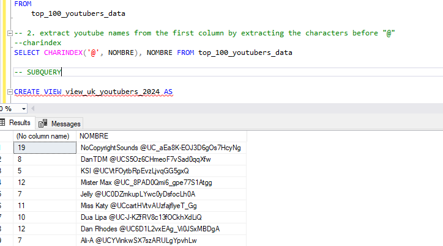
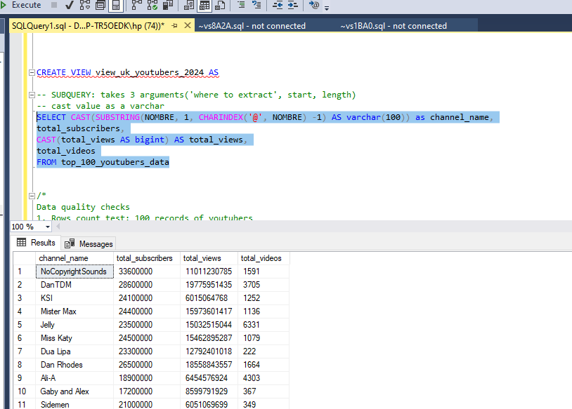
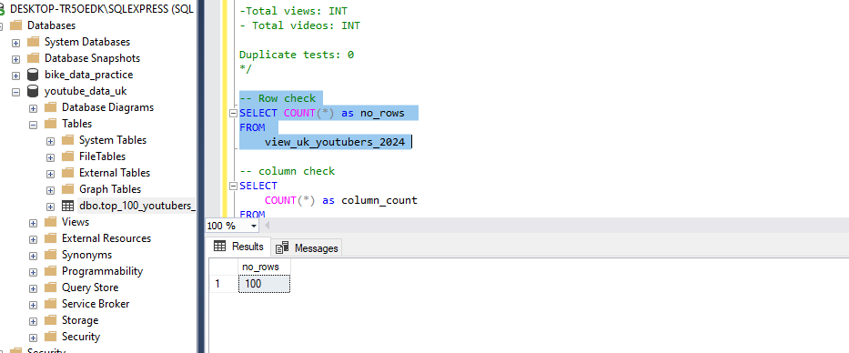
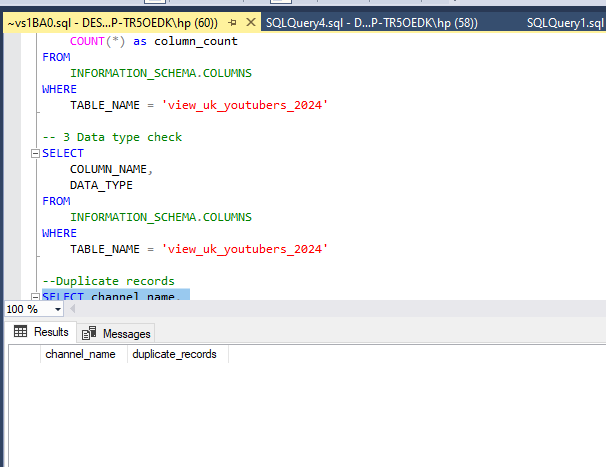
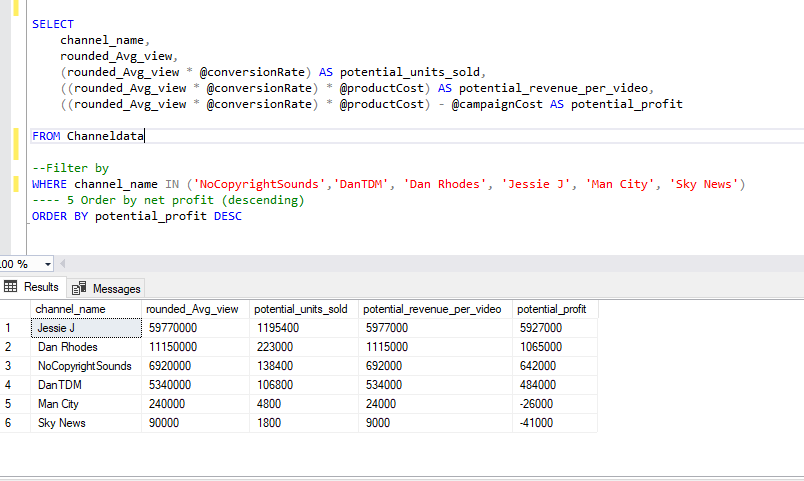
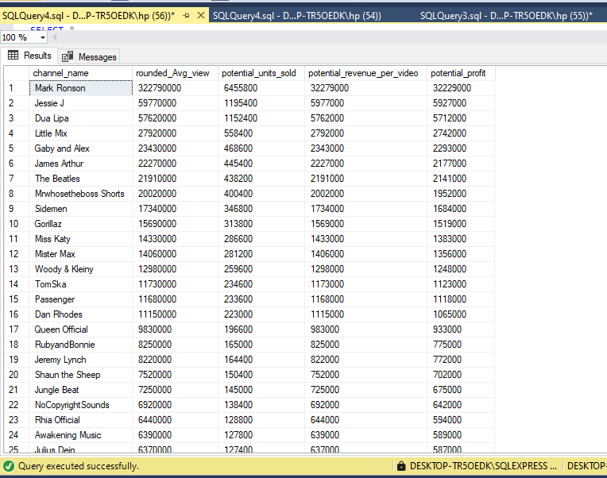
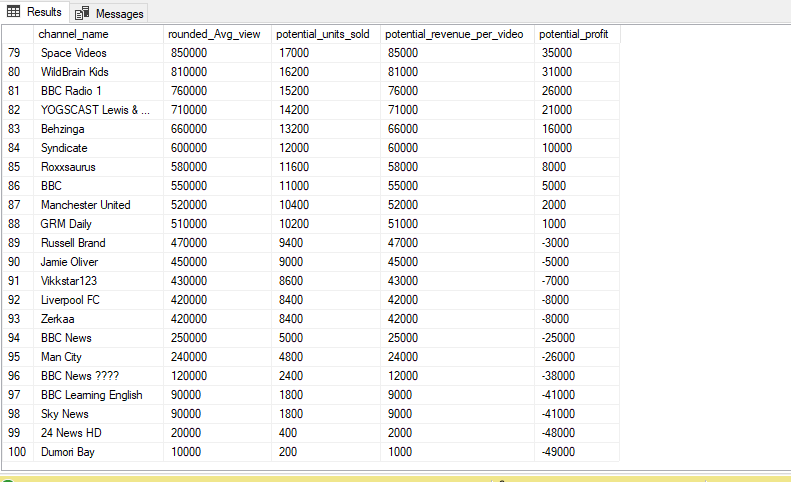

# Data Portfolio: SQL to Power BI to Excel


# Table of contents 
- [Objective](#objective)
- [Data Source](#data-source)
- [Stage](#stages)
- [Design](#design)
    - [Tools](#tools)
- [Development](#development)
    - [Pseudocode](#pseudocode)
    - [Data Exploration](#data-exploration)
    - [Data Cleaning](#data-cleaning)
    - [Data Transformation](#data-transformation)
    - [Create the SQL view](#create-the-sql-view)
- [Data Quality Test](#data-quality-test)
- [Visualization](#visualization)
  - [Results](#results)
  - [DAX Measures](#dax-measures)
- [Analysis](#analysis)
  - [Findings](#findings)
  - [Validation](#validation)
  - [Discovery](#discovery)
- [Recommendation](#recommendation)
  - [Potential ROI](#potential-roi)
  - [Action Plan](#action-plan)

 

# Objective  
 <br>
- Key Point

 The Head of Marketing wants to find out who the top YouTubers are in 2024 to decide which ones to use for the rest of the year's marketing campaigns

 - Solution
Create a dashboard that provides insights into the top UK YouTubers in 2024 including their:
- total number of subscriber 
- total number of views
- total number of videos, and
- engagement metrics

This will help the marketing team make data-driven decisions about which YouTubers to collaborate with for their marketing campaigns.


## User story 

As the Head of Marketing, I need a dashboard that can help me analyze YouTube channel data within the UK. 

This dashboard should allow me to identify the top-performing channels based on KPIs like subscriber base and average views. 

With this information, I can make more informed decisions about which Youtubers are right to collaborate with, to maximize each marketing campaign.


# Data source 

we need data on the top UK YouTubers in 2024 including their: 
- channel names
- total subscribers
- total views
- total videos uploaded

- Data Source
Kaggle. [see here to find it.](https://www.kaggle.com/datasets/bhavyadhingra00020/top-100-social-media-influencers-2024-countrywise?resource=download)


# Stages

- Design
- Development
- Testing
- Analysis 
 

# Design 

## Dashboard features  

To understand what features it should contain, we need to figure out what questions we need the dashboard to answer:

1. Who are the top 10 YouTubers with the most subscribers**?
2. What are the top 3 channels with the most videos uploaded?
3. What are the top 3 channels with the most views?
4. What are the top 3 channels with the highest average views per video?
5. What are the top 3 channels with the highest views per subscriber ratio?
6. What are the top 3 channels with the highest subscriber engagement rate per video uploaded?

These are some of the questions we need to answer.


## Dashboard mockup

Some of the data visuals that may be appropriate for answering our questions include:

1. Table
2. Treemap
3. Scorecards
4. Horizontal bar chart 


## Tools 


| Tool | Purpose |
| ---- | ---- |
| Excel | Exploring the data |
| SQL Server | Cleaning, quality testing, and analyzing the data |
| Power BI | Visualizing the data via interactive dashboards |
| GitHub | Hosting the project documentation and version control |

# Development

## Pseudocode

- What's the general approach in creating this solution from start to finish?

1. Get the data
2. Explore the data in Excel
3. Load the data into SQL Server
4. Clean the data with SQL
5. Test the data with SQL
6. Visualize the data in Power BI
7. Generate the findings based on the insights
8. Write the documentation + commentary
9. Publish the data to GitHub Pages

### Data Exploration

This is the stage where you have a scan of what's in the data including errors, inconsistencies, corrupted characters, etc  


- Initial observations 

1. There are at least 4 columns that contain the data we need for this analysis.
2. The first column contains the channel ID with what appears to be channel IDS, which are separated by a @ symbol - we need to extract the channel names from this.
3. Some of the cells and header names are in a different language - we need to confirm if these columns are needed, and if so, we need to fix them.
4. We have more data than we need, so some of these columns would need to be removed


## Data cleaning 

The aim is to refine our dataset to ensure it is structured and ready for analysis. 

The cleaned data should meet the following criteria and constraints:

- Only relevant columns should be extracted.
- All data types should be appropriate for the contents of each column (e.g VARCHAR. INT)
- No column should contain null values, indicating complete data for all records.

Below is a table outlining the constraints on our cleaned dataset:
|Property| Description|
|--------| -----------|
|Nunber of Rows| 100|
|Number of columns | 4|

Here's the tabular representation of the expected schema of the clean data:
|Column name| Data type| Null values|
|-----------|----------|------------|
|channel_name|VARCHAR| - |
|tota_subscribers| INT |-|
|total_views| INT|-|
|total_videos| INT|-|

-Steps are needed to clean and shape the data:

1. Remove unnecessary columns by only selecting the ones needed
2. Extract YouTube channel names from the first column(characters before the "@")
3. Rename columns using aliases


## Data Transformation 

```SQL
/*
# 1. Select the required columns
# 2. Extract the channel name from the 'NOMBRE' column
*/

-- 1.
SELECT
    NOMBRE,
    total_subscribers,
    total_views,
    total_videos
FROM
    top_uk_youtubers_2024

--2.  Extract YouTube names from the "NOMBRE" column 
SELECT
  (SUBSTRING(NOMBRE, 1, CHARINDEX('@', NOMBRE) -1) AS varchar(100)) as channel_name
---

```


### Create the SQL view
store the transformed data




# Data quality test
Here are the data quality tests conducted:
- Row check: 4
- Column check: 100
- Check for the appropriate data types(VARCHAR, INT)
- Duplicates records: nil


## Test 1: Row count check
Below is the SQL query with the result


## Test 2: Column count check
Below is the SQL query with the result 


## Test 3: Data type check
Below is the SQL query with the result


## Test 4: Duplicate count check
Below is the SQL query with the result


```
```


# Visualization 


## Results

- What does the dashboard look like?


This dashboard shows the key metrics to analyze the top 100 Youtubers in 2024. 


## DAX Measures
We use DAX to make some simple calculations that aid our visual storytelling

### 1. Total Subscribers (M)
```sql
Total Subscribers (M) = 
VAR million = 1000000
VAR sumOfSubscribers = SUM(view_uk_youtubers_2024[total_subscribers])
VAR totalSubscribers = DIVIDE(sumOfSubscribers,million)

RETURN totalSubscribers

```

### 2. Total Views (B)
```sql
Total Views (B) = 
VAR billion = 1000000000
VAR sumOfTotalViews = SUM(view_uk_youtubers_2024[total_views])
VAR totalViews = ROUND(sumOfTotalViews / billion, 2)

RETURN totalViews

```

### 3. Total Videos
```sql
Total Videos = 
VAR totalVideos = SUM(view_uk_youtubers_2024[total_videos])

RETURN totalVideos

```

### 4. Average Views Per Video (M)
```sql
Average Views per Video (M) = 
VAR sumOfTotalViews = SUM(view_uk_youtubers_2024[total_views])
VAR sumOfTotalVideos = SUM(view_uk_youtubers_2024[total_videos])
VAR  avgViewsPerVideo = DIVIDE(sumOfTotalViews,sumOfTotalVideos, BLANK())
VAR finalAvgViewsPerVideo = DIVIDE(avgViewsPerVideo, 1000000, BLANK())

RETURN finalAvgViewsPerVideo 

```


### 5. Subscriber Engagement Rate
```sql
Subscriber Engagement Rate = 
VAR sumOfTotalSubscribers = SUM(view_uk_youtubers_2024[total_subscribers])
VAR sumOfTotalVideos = SUM(view_uk_youtubers_2024[total_videos])
VAR subscriberEngRate = DIVIDE(sumOfTotalSubscribers, sumOfTotalVideos, BLANK())

RETURN subscriberEngRate 

```


### 6. Views per subscriber
```sql
Views Per Subscriber = 
VAR sumOfTotalViews = SUM(view_uk_youtubers_2024[total_views])
VAR sumOfTotalSubscribers = SUM(view_uk_youtubers_2024[total_subscribers])
VAR viewsPerSubscriber = DIVIDE(sumOfTotalViews, sumOfTotalSubscribers, BLANK())

RETURN viewsPerSubscriber 

```


# Analysis 

## Findings

For this analysis, we're going to focus on the questions below to extract the information we need to provide insights for our marketing client - 

Here are the questions we need to answer: 
1. Who are the top 10 YouTubers with the most subscribers**?
2. What are the top 3 channels with the most videos uploaded?
3. What are the top 3 channels with the most views?
4. What are the top 3 channels with the highest average views per video?
5. What are the top 3 channels with the highest views per subscriber ratio?
6. What are the top 3 channels with the highest subscriber engagement rate per video uploaded?


### 1. Who are the top 10 YouTubers with the most subscribers?

| Rank | Channel Name         | Subscribers (M) |
|------|----------------------|-----------------|
| 1    | NoCopyrightSounds    | 33.60           |
| 2    | DanTDM               | 28.60           |
| 3    | Dan Rhodes           | 26.50           |
| 4    | Miss Katy            | 24.50           |
| 5    | Mister Max           | 24.40           |
| 6    | KSI                  | 24.10           |
| 7    | Jelly                | 23.50           |
| 8    | Dua Lipa             | 23.30           |
| 9    | Sidemen              | 21.00           |
| 10   | Ali-A                | 18.90           |


### 2. Which 3 channels have uploaded the most videos?

| Rank | Channel Name    | Videos Uploaded |
|------|-----------------|-----------------|
| 1    | GRM Daily       | 14,696          |
| 2    | Manchester City | 8,248           |
| 3    | Yogscast        | 6,435           |


### 3. Which 3 channels have the most views?


| Rank | Channel Name | Total Views (B) |
|------|--------------|-----------------|
| 1    | DanTDM       | 19.78           |
| 2    | Dan Rhodes   | 18.56           |
| 3    | Mister Max   | 15.97           |


### 4. Which 3 channels have the highest average views per video?

| Channel Name | Averge Views per Video (M) |
|--------------|-----------------|
| Mark Ronson  | 32.27           |
| Jessie J     | 5.97            |
| Dua Lipa     | 5.76            |


### 5. Which 3 channels have the highest views per subscriber ratio?

| Rank | Channel Name       | Views per Subscriber        |
|------|-----------------   |---------------------------- |
| 1    | GRM Daily          | 1185.79                     |
| 2    | Nickelodeon        | 1061.04                     |
| 3    | Disney Junior UK   | 1031.97                     |


### 6. Which 3 channels have the highest subscriber engagement rate per video uploaded?

| Rank | Channel Name    | Subscriber Engagement Rate  |
|------|-----------------|---------------------------- |
| 1    | Mark Ronson     | 343,000                     |
| 2    | Jessie J        | 110,416.67                  |
| 3    | Dua Lipa        | 104,954.95                  |


### Notes

For this analysis, we'll prioritize analysing the metrics that are important in generating the expected ROI for our marketing client, which are the YouTube channels wuth the most 

- subscribers
- total views
- videos uploaded


## Validation  

#### Calculation breakdown
Product cost = $5, Campagin budget = $50,000, Conmversion rate = 2%
Potential revenue = Average_views_per_video * 0.02(conversion rate) * $5 (product cost)
**Potential Profit **= Revenue - $50,000(campaign budget)

### Reconcilloiation between SQL results and Manual Calculation
1. NoCopyrightSounds 
- Average views per video = 6.92 million
- Potential revenue per video = 6.92 million x 2% conversion rate x $5 = $692,000
- **Net profit = $692,000 - $50,000 = $642,000**

b. DanTDM
- Average views per video = 5.34 million
- Potential revenue per video = 5.34 million x 2% conversion rate x $5 = $534,000
- **Net profit = $534,000 - $50,000 = $484,000**

c. Dan Rhodes
- Average views per video = 11.15 million
- Potential revenue per video = 11.15 million x 2% conversion rate x $5 = $1,115,000
- **Net profit = $1,115,000 - $50,000 = $1,065,000**

d. Jessie J
- Average views per video = 59.8 million
- Potential revenue per video = 59.77 million x 2% conversion rate x $5 = $5,977,000
- **Net profit = $5,977,000 - $50,000 = $5,927,000**

e. SKY News
- Average views per video = 90,000
- Potential revenue per video = 90,000 x 2% conversion rate x $5 = $9,000
- **Net profit = $9,000- $50,000 = -$41,000(potential loss)**

f. Man City
- Average views per video = 240000
- Potential revenue per video = 240,000 x 2% conversion rate x $5 = $24,000
-  **Net profit = $24,000- $50,000 = -$26,000(potential loss)**



## Profit analysis for the different youtubers categories

### 1. Youtubers with the most subscribers
Campaign idea = product placement 
Best option from category: Dan Rhodes
1. NoCopyrightSounds
- **Net profit = $642,000**
3. Dan TDM
- **Net profit = $484,000**
4. Dan Rhodes
- **Net profit = $1,065,000**

### 2. Youtubers with the most videos uploaded
Campaign idea = sponsored video series  

1. GRM Daily
- **Net profit = -$26,000 (potential loss)**
b. **Manchester City**
- **Net profit = $1,000 (break even)**
b. **Yogscast**
- **Net profit = $21,000 (profit)**

Best option from category: Yogscast

### 3.  Youtubers with the most views 
Campaign idea = Influencer marketing 
a. DanTDM
- **Net profit =  $484,000**
b. Dan Rhodes
- **Net profit = $1,065,000**
c. Mister Max
- **Net profit = $1,356,000**

Best option from category: Mister Max

### SQL Results for the most vs least profitbale profitbale
|Top 25 Most Profitable  Youtubers|
|---------------|
||


|Top 25 Least Profitable Youtubers|
|---------------|
||


## Discovery

- What can we learn?

We discovered that 


1. **Most Profitable youtubers:** The youtubers with the most potential for profits are influencers, celebrities and musical channels.
2.**Least Profitable youtubers:** The youtubers the least potential for profits/loss are News channels and Foootball channels.
3. **NoCopyrightSOunds, Dan Rhodes, and DanTDM** are the channels with the most subscribers in the UK
4. **GRM Daily, Man City, and Yogscast** are the channels with the most videos uploaded
5. **DanTDM, Dan Rhodes and Mister Max** are the channels with the most views
6. Entertainment and music channels are useful for broader reach, as the channels posting consistently on their platforms generatE the most engagement. 


## Recommendation
  
1. Celebrity channels would have been great to partner with because of their massive reach but it would cost beyond our budget.
2. Dan Rhodes is the best YouTube channel to collaborate with if we want to maximize visibility because this channel has the most YouTube subscribers in the UK
3. Although GRM Daily, Man City, and Yogcasts are regular publishers on YouTube, with the budget, these channels may not return good interest rates as the potential ROI is significantly lower compared to other channels.
4. Mister Max is the best YouTuber to collaborate with if we're interested in maximizing reach, but collaborating with DanTDM and Dan Rhodes may be better long-term options considering the fact that they both have large subscriber bases and are averaging significantly higher number of views.
5. The top 3 channels to form collaborations with are NoCopyrightSounds, DanTDM and Dan Rhodes based on this analysis, because they attract the most engagement on their channels consistently.


### Potential ROI 
- What ROI do we expect if we take this course of action?

1. Setting up a collaboration deal with Dan Rhodes would make the client a net profit of $1,065,000 per video
2. An influencer marketing contract with Mister Max can see the client generate a net profit of $1,276,000
3. If we go with a product placement campaign with DanTDM, this could  generate the client approximately $484,000 per video.
4. NoCopyrightSounds could profit the client $642,000 per video too (which is worth considering) 


### Action plan
- What course of action should we take and why?

Based on our analysis, the best channel to advance a long-term partnership deal with to promote the client's products is the Dan Rhodes channel. 

We'll have conversations with the marketing client to forecast what they expect from this collaboration. Once we observe we're hitting the expected milestones, we'll advance with potential partnerships with DanTDM, Mister Max, and NoCopyrightSounds channels.   

- What steps do we take to implement the recommended decisions effectively?


1. Reach out to the teams behind each of these channels, starting with Dan Rhodes
2. Negotiate contracts within the budgets allocated to each marketing campaign
3. Kick off the campaigns and track each of their performances against the KPIs
4. Review how the campaigns have gone, gather insights, and optimize based on feedback from converted customers and each channel's audiences 


